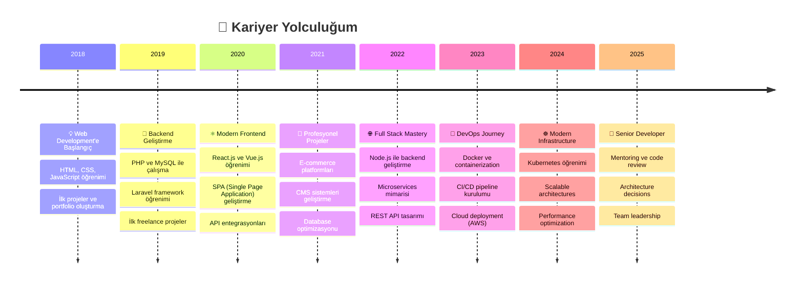

<div align="center">
  
</div>

<div align="center">
  
</div>

<div align="center">
  
  
  
</div>

<br>

## &nbsp;***Hakkımda***


```typescript
interface Developer {
  name: string;
  location: string;
  role: string;
  languages: string[];
  specialties: string[];
  currentFocus: string[];
  philosophy: string;
  availability: string;
}

const mehmetSalih: Developer = {
  name: "Mehmet Salih Yaldız",
  location: "Konya, Türkiye 🇹🇷",
  role: "Senior Full Stack Developer",
  languages: ["Turkish (Native)", "English (Advanced)"],
  specialties: [
    "Full Stack Web Development",
    "RESTful API Design & Development", 
    "Database Architecture & Optimization",
    "DevOps & Container Technologies",
    "Performance Optimization",
    "Code Review & Mentoring"
  ],
  currentFocus: [
    "Microservices Architecture",
    "Docker & Kubernetes Mastery",
    "Cloud Native Applications",
    "Advanced React Patterns"
  ],
  philosophy: "Clean code is not written by following rules. Clean code is written by 'clean' developers.",
  availability: "Open for freelance & collaboration 🟢"
};
```

<br>

## &nbsp;***Teknoloji Arsenal'im***

<details>
<summary><b>🎨 Frontend Teknolojileri</b></summary>
<br>

<div align="center">

| Technology | Proficiency | Experience | Projects |
|------------|-------------|------------|----------|
|  | ████████████ 95% | 4+ years | 50+ |
|  | ████████████ 90% | 3+ years | 30+ |
|  | ████████████ 98% | 6+ years | 100+ |
|  | ████████████ 85% | 2+ years | 25+ |
|  | ████████████ 80% | 2+ years | 20+ |
|  | ████████████ 90% | 3+ years | 40+ |

</div>
</details>

<details>
<summary><b>⚙️ Backend Teknolojileri</b></summary>
<br>

<div align="center">

| Technology | Proficiency | Experience | API Projects |
|------------|-------------|------------|--------------|
|  | ████████████ 98% | 7+ years | 80+ |
|  | ████████████ 88% | 4+ years | 45+ |
|  | ████████████ 95% | 5+ years | 60+ |
|  | ████████████ 85% | 3+ years | 30+ |
|  | ████████████ 75% | 2+ years | 15+ |

</div>
</details>

<details>
<summary><b>🗄️ Database & Storage</b></summary>
<br>

<div align="center">

| Database | Proficiency | Use Cases | Performance Tuning |
|----------|-------------|-----------|-------------------|
|  | ████████████ 95% | E-commerce, CMS, ERP | ✅ Advanced |
|  | ████████████ 88% | Analytics, Reporting | ✅ Intermediate |
|  | ████████████ 82% | Real-time Apps | ✅ Intermediate |
|  | ████████████ 85% | Caching, Sessions | ✅ Advanced |

</div>
</details>

<details>
<summary><b>🚀 DevOps & Cloud</b></summary>
<br>

<div align="center">

| Technology | Proficiency | Experience | Projects |
|------------|-------------|------------|----------|
|  | ████████████ 85% | 2+ years | 25+ |
|  | ████████████ 70% | 1+ year | 10+ |
|  | ████████████ 75% | 2+ years | 15+ |
|  | ████████████ 90% | 5+ years | Daily Use |

</div>
</details>

<br>

## &nbsp;***GitHub Analytics*** 

<div align="center">
  
  
</div>

<div align="center">
  
</div>

<div align="center">
  
</div>

<br>

## &nbsp;***Coding Activity***

<div align="center">
  
</div>

<!--START_SECTION:waka-->
```text
💻 Bu Hafta Kod Yazma Sürem:

PHP          12 hrs 34 mins  ████████████░░░░░░░░░░░░░   48.2%
JavaScript   8 hrs 12 mins   ███████████░░░░░░░░░░░░░░   31.5%
TypeScript   3 hrs 45 mins   ████░░░░░░░░░░░░░░░░░░░░░   14.4%
Docker       1 hr 23 mins    █░░░░░░░░░░░░░░░░░░░░░░░░    5.3%
YAML         10 mins         ░░░░░░░░░░░░░░░░░░░░░░░░░    0.6%
```
<!--END_SECTION:waka-->

<br>

## &nbsp;***Öne Çıkan Projelerim***

<div align="center">
  <table>
    <tr>
      <td width="50%">
        <h3 align="center">🏪 E-Commerce Platform</h3>
        <div align="center">  
          <a href="https://github.com/mehmetsalihyaldiz" target="_blank">
            
          </a>
          <br>
          <p><strong>Laravel + Vue.js + MySQL</strong></p>
          <p>Modern e-ticaret çözümü - Ödeme entegrasyonları, stok yönetimi, admin paneli</p>
        </div>
      </td>
      <td width="50%">
        <h3 align="center">📊 Analytics Dashboard</h3>
        <div align="center">
          <a href="https://github.com/mehmetsalihyaldiz" target="_blank">
            
          </a>
          <br>
          <p><strong>React + Node.js + PostgreSQL</strong></p>
          <p>Real-time veri görselleştirme - Chart.js, WebSocket, responsive tasarım</p>
        </div>
      </td>
    </tr>
    <tr>
      <td width="50%">
        <h3 align="center">🔐 Authentication API</h3>
        <div align="center">
          <a href="https://github.com/mehmetsalihyaldiz" target="_blank">
            
          </a>
          <br>
          <p><strong>Node.js + JWT + Redis</strong></p>
          <p>Güvenli kimlik doğrulama sistemi - OAuth2, 2FA, rate limiting</p>
        </div>
      </td>
      <td width="50%">
        <h3 align="center">🐳 Docker Templates</h3>
        <div align="center">
          <a href="https://github.com/mehmetsalihyaldiz" target="_blank">
            
          </a>
          <br>
          <p><strong>Docker + Docker Compose</strong></p>
          <p>Hazır geliştirme ortamları - LAMP, LEMP, MEAN, Django</p>
        </div>
      </td>
    </tr>
  </table>
</div>

<div align="center">
  <a href="https://github.com/mehmetsalihyaldiz?tab=repositories">
    
  </a>
</div>

<br>

## &nbsp;***Profesyonel Deneyim***

<div align="center">



</div>

<br>

## &nbsp;***Başarılarım & Sertifikalarım***

<div align="center">
  <table>
    <tr>
      <td align="center" width="33%">
        
        <br><strong>Tamamlanan Projeler</strong>
      </td>
      <td align="center" width="33%">
        
        <br><strong>Müşteri Memnuniyeti</strong>
      </td>
      <td align="center" width="33%">
        
        <br><strong>API Entegrasyonları</strong>
      </td>
    </tr>
  </table>
</div>

<details>
<summary><b>📜 Sertifikalar & Eğitimler</b></summary>
<br>

- 🎓 **Web Development Bootcamp** - Udemy (2020)
- 🏅 **Advanced React Patterns** - Frontend Masters (2021) 
- 🐳 **Docker & Kubernetes** - Linux Academy (2023)
- ☁️ **AWS Solutions Architect** - Amazon Web Services (2023)
- 🔐 **Cybersecurity Fundamentals** - IBM (2024)
- 📊 **Database Design & Optimization** - MongoDB University (2024)

</details>

<br>

## &nbsp;***Çalışma Alanlarım***

<div align="center">
  <table>
    <tr>
      <td valign="top" width="50%">
        <h3>🎯 Uzmanlık Alanlarım</h3>
        
        **💻 Web Development**
        - Single Page Applications (SPA)
        - Progressive Web Apps (PWA)
        - Responsive Design
        - Cross-browser Compatibility
        
        **🔧 Backend Development**
        - RESTful & GraphQL APIs
        - Microservices Architecture
        - Database Design & Optimization
        - Server Administration
        
        **🚀 DevOps & Deployment**
        - Docker Containerization
        - CI/CD Pipelines
        - Cloud Infrastructure (AWS)
        - Performance Monitoring
        
      </td>
      <td valign="top" width="50%">
        <h3>🌟 Hizmet Alanlarım</h3>
        
        **🏪 E-Commerce Solutions**
        - Custom shopping platforms
        - Payment gateway integrations
        - Inventory management systems
        - Multi-vendor marketplaces
        
        **📊 Business Applications**
        - CRM & ERP systems
        - Data analytics dashboards
        - Reporting tools
        - Workflow automation
        
        **🔗 API & Integration**
        - Third-party API integrations
        - Custom API development
        - Webhook implementations
        - Data synchronization
        
      </td>
    </tr>
  </table>
</div>

<br>

## &nbsp;***Öğrenim & Gelişim***

<div align="center">

```ascii
   📚 Sürekli Öğrenme Yolculuğum
   ┌─────────────────────────────────┐
   │  🎯 Şu An Öğreniyorum           │
   │  ├── Kubernetes & Helm Charts   │
   │  ├── GraphQL & Apollo Server    │
   │  ├── Microservices Patterns     │
   │  └── Machine Learning Basics    │
   │                                 │
   │  🔜 Yakın Hedeflerim            │
   │  ├── AWS Certified Architect    │
   │  ├── System Design Mastery      │
   │  ├── Go Programming Language    │
   │  └── Blockchain Development     │
   └─────────────────────────────────┘
```

</div>

<div align="center">
  
</div>

<br>

## &nbsp;***Portfolyo & İş Birliği***

<div align="center">
  <table>
    <tr>
      <td align="center">
        <a href="https://msydeveloper.com">
          
        </a>
        <br><em>Projelerim ve deneyimlerim</em>
      </td>
      <td align="center">
        <a href="https://bionluk.com/msydeveloper">
          
        </a>
        <br><em>Freelance hizmetlerim</em>
      </td>
    </tr>
  </table>
</div>

<details>
<summary><b>💰 Freelance Hizmetlerim</b></summary>
<br>

| Hizmet | Süre | Fiyat Aralığı | Detay |
|--------|------|---------------|-------|
| 🌐 **Website Geliştirme** | 1-4 hafta | $500 - $3000 | Responsive, SEO-friendly |
| 🔌 **API Geliştirme** | 1-2 hafta | $300 - $1500 | RESTful, dokumentasyonlu |
| 🛒 **E-Commerce Platform** | 2-6 hafta | $1000 - $5000 | Full-featured, payment ready |
| 📊 **Dashboard & Admin Panel** | 1-3 hafta | $400 - $2000 | Modern UI, real-time data |
| 🐳 **DevOps Setup** | 3-7 gün | $200 - $800 | Docker, CI/CD, deployment |
| 🔧 **Code Review & Optimization** | 1-5 gün | $100 - $500 | Performance, security |

</details>

<br>

## &nbsp;***İletişim & Sosyal Medya***

<div align="center">
  <table>
    <tr>
      <td align="center">
        <a href="mailto:mehmetsalihyaldiz@gmail.com">
          
          <br><strong>Email</strong>
        </a>
      </td>
      <td align="center">
        <a href="https://linkedin.com/in/mehmetsalihyaldiz">
          
          <br><strong>Professional</strong>
        </a>
      </td>
      <td align="center">
        <a href="https://twitter.com/msalihyaldiz">
          
          <br><strong>Updates</strong>
        </a>
      </td>
      <td align="center">
        <a href="https://instagram.com/msalihyaldiz">
          
          <br><strong>Lifestyle</strong>
        </a>
      </td>
    </tr>
  </table>
</div>

<div align="center">
  <h3>💬 Hadi Konuşalım!</h3>
  <p>Projeleriniz, fikirleriniz ya da işbirliği fırsatları hakkında konuşmaya her zaman açığım.</p>
  <p><strong>En hızlı yanıt:</strong> Email 📧 | <strong>En detaylı görüşme:</strong> LinkedIn 💼</p>
</div>

<br>

## &nbsp;***Son Olarak...***

<div align="center">
  
  ### 🎯 2025 Hedeflerim
  
  ```yaml
  professional_goals:
    - Kubernetes certification almak
    - Open source projelere daha fazla katkıda bulunmak
    - Tech blog yazmaya başlamak
    - Mentoring programlarına katılmak
    
  technical_goals:
    - Microservices mimarisinde uzmanlaşmak
    - Machine Learning entegrasyonları öğrenmek
    - Performance optimization masterclass
    - System design patterns derinleşmek
    
  personal_goals:
    - Work-life balance iyileştirmek
    - Yeni teknolojileri takip etmek
    - Community etkinliklerine katılmak
    - Knowledge sharing artırmak
  ```

</div>

<div align="center">
  
</div>

<div align="center">
  <h3>🌟 Bu Profili Beğendiysen Star Vermeyi Unutma!</h3>
  <p>Açık kaynak projelerime katkıda bulunmak istersen, pull request'lerini sabırsızlıkla bekliyorum! 🚀</p>
  
  
  
  <h4>✨ Birlikte Harika Şeyler Yaratalım! ✨</h4>
</div>

---

<div align="center">
  
</div>

<div align="center">
  <sub>💖 Made with passion by <a href="https://github.com/mehmetsalihyaldiz">Mehmet Salih Yaldız</a></sub>
  <br>
  <sub>🚀 Always learning, always building, always improving</sub>
</div>

<h1 align="center">👋 Mehmet Salih Yaldız</h1>
<h3 align="center">Senior Full-Stack Developer • Freelance Çalışıyor • Türkiye</h3>

<p align="center">
  <a href="https://msydeveloper.com" target="_blank"><strong>🌐 Web Sitem: msydeveloper.com</strong></a><br>
  <a href="https://bionluk.com/msydeveloper" target="_blank">💼 Bionluk Profilim</a> • 
  <a href="mailto:mehmetsalihyaldiz@gmail.com">📩 E-posta Gönder</a>
</p>

---

## 🚀 Hakkımda

Merhaba, ben Salih. Gündüzleri bir belediyede yazılım geliştirici olarak çalışıyorum, akşamları ise kendi işime odaklanan bir freelancerım.  
10+ yıllık yazılım geçmişim var. Backend'de sağlam, frontend'de hızlıyım.  
Erişilebilirlik, performans, sade kod ve güvenli sistemler üzerine yoğunlaşıyorum.

- 🧠 **Backend**: PHP (Laravel, Lumen), Node.js (Express)
- 🎨 **Frontend**: React.js, Vue.js, Tailwind, EJS
- 🧩 **Veritabanı**: PostgreSQL, SQLite, MySQL
- 📦 **Araçlar & Sistemler**: Docker, Nginx, Git, Redis, Firebase, OAuth 2.0
- 🔒 **Öncelikler**: Güvenlik, performans, sade mimari

---

## 📌 Aktif Projeler

| Proje Adı | Açıklama | Durum |
|----------|----------|-------|
| 🧾 **e-Fatura / e-Arşiv Çıktı Sistemi** | PHP ile e-Arşiv çıktısı üretimi (gerçek formatlı) | ✅ Yayında |
| 🌐 **MSY Developer Web Sitesi** | Kişisel tanıtım ve portföy | 🛠️ Gelişiyor |
| 📦 **Kargo Takip Botu (Telegram)** | Kargoyu otomatik kontrol eder, durum değişince Telegram'a bildirir | ✅ Aktif |
| 🎥 **Netflix Benzeri Platform** | Video şifreleme ve erişim kontrollü oynatma | ⚙️ Devam ediyor |
| 🗺️ **Hobi Bahçesi Harita Sistemi** | Google Maps + Parsel API + Konum odaklı görünüm | ✅ Test aşamasında |

---

## 📊 GitHub İstatistikleri

<p align="center">
  
  
</p>

---

## 🧰 Kullandığım Teknolojiler

<p align="center">
  
  
  
  
  
  
  
  
  
  
  
</p>

---

## 🧭 Vizyon & Hedefler

- 📌 Karmaşadan uzak, sade sistemler üretmek  
- 👥 Girişimlere danışmanlık ve yazılım partnerliği sunmak  
- 🚀 Kendi ürünümü geliştirmek ve büyütmek  
- 🎯 Erişilebilir çözümlerle daha kapsayıcı dijital ürünler yaratmak

---

## 🤝 Bağlantılar

<p align="center">
  <a href="https://twitter.com/msalihyaldiz"></a>
  <a href="https://linkedin.com/in/mehmetsalihyaldiz"></a>
  <a href="https://instagram.com/msalihyaldiz"></a>
</p>

---

## 🧩 Kısa Not

> "Kod yazmak yalnızca bir iş değil, sade çözümlerle dünyayı biraz daha anlaşılır kılma yolculuğu."

---


<h1 align="center">👋 Mehmet Salih Yaldız</h1>
<h3 align="center">Senior Full-Stack Developer | Freelancer | Türkiye</h3>

<p align="center">
  <a href="https://msydeveloper.com" target="_blank"><strong>🌐 msydeveloper.com</strong></a> • 
  <a href="https://bionluk.com/msydeveloper" target="_blank">💼 Bionluk</a> • 
  <a href="mailto:mehmetsalihyaldiz@gmail.com">📬 E-posta</a>
</p>

---

## 🧑‍💻 Hakkımda

10+ yıllık yazılım deneyimiyle; sade, güvenli ve sürdürülebilir sistemler geliştirme odağındayım.  
Gündüzleri bir kamu kurumunda görevliyim, akşamları ise girişimlere destek veren bir **freelance geliştirici** olarak çalışıyorum.  
Kendi firmam olan **MSY Developer** çatısı altında; e-ticaret sistemlerinden özel entegrasyonlara, API mimarisinden video platformlarına kadar geniş bir yelpazede ürün geliştiriyorum.

- 🚀 Tam yığın (full-stack) geliştirme
- 🔒 Güvenli ödeme ve oturum sistemleri
- 🗺️ Harita ve konum tabanlı uygulamalar
- 📦 Otomasyonlar, botlar, fatura sistemleri

---

## 🔧 Kullandığım Teknolojiler

### Backend


### Frontend


### Diğer Araçlar


---

## 🚀 Aktif Projelerim

| Proje Adı | Teknolojiler | Durum |
|----------|--------------|-------|
| 🎥 **Video Platformu (şifreli oynatma)** | Node.js, React, JWT, Stream | ⚙️ Devam Ediyor |
| 🧾 **e-Fatura/e-Arşiv Çıktı** | PHP, DOMPDF, Laravel | ✅ Yayında |
| 📦 **Telegram Kargo Takip Botu** | Node.js, Cheerio, Telegraf | ✅ Kullanımda |
| 🗺️ **Hobi Bahçesi Harita Sistemi** | Google Maps API, Vue, Koordinat API | ✅ Testte |
| 💳 **PAYTR Entegrasyon + Güvenli Ödeme** | Node.js, EJS, Middleware Validation | ✅ Yayında |

---

## 📈 GitHub Aktivitelerim

<p align="center">
  
  
</p>

<p align="center">
  
</p>

---

## 🧠 İlgi Alanlarım

- 🔐 Şifreleme ve güvenlik sistemleri
- 🧩 Mikro servis mimarileri
- 📡 Web scraping & API tüketimi
- 📚 Kişisel verimlilik ve disiplin sistemleri
- 🧏‍♂️ Erişilebilirlik odaklı projeler (kendim de işitme engelliyim)

---

## 💡 İlginç Bilgiler

- 🎯 Kod yazarken yalnızca işlevi değil, kullanıcı deneyimini de düşünürüm.
- 🧩 Kendi GPT tabanlı yardımcı botumu geliştirdim.
- 📚 Bilgiye takıntılıyım. Her gün öğrenmeden günü bitirmem.
- ⏱️ Trello + Kanban ile daha disiplinli çalışmak için sistematik bir planım var.

---

## 📬 Bana Ulaş

<p align="center">
  <a href="https://linkedin.com/in/mehmetsalihyaldiz"></a>
  <a href="https://bionluk.com/msydeveloper"></a>
  <a href="mailto:mehmetsalihyaldiz@gmail.com"></a>
  <a href="https://msydeveloper.com"></a>
</p>

---

## 🧭 Hedefim Ne?

> Daha sade yazılım, daha net iletişim, daha etkili çözümler.  
> Geliştirici değil, **çözüm ortağı** olmak için buradayım.

---


